Assignment 1: Tree Census in NYC
================
Alfredo Rojas and Jeffrey Robbins
2/18/2020

### Introduction

What can trees in urban neighborhoods tell us about income inequality in
New York City? In March of 2014, Ben Willington of the Pratt Institute
in Brooklyn wrote a
[blog](https://iquantny.tumblr.com/post/78823307914/are-you-in-one-of-nycs-treeiest-neighborhoods)
exploring this question. In the end, Willington concluded that there was
a slight correlation between the number of trees in neighborhoods and
median income. In order to tell this story, the author relied on the
[Tree
Census](https://data.cityofnewyork.us/Environment/2005-Street-Tree-Census/29bw-z7pj)
of 2005, an open data project where volunteers went around New York City
and virtually counted every single tree–an impressive feat.
Dr. Willington relied on this open data to create graphs of trees
within New York City’s boroughs, as well as reporting median income data
to analyze relationships between tree density and income in
neighborhoods. In this paper, we will go over Willington’s analysis and
graphical storytelling, arguing that the author’s visuals could be
improved to make the story more compelling and interpretable for
everyday readers.

### Tree Census Data Source

We and the author utilized the 2005 Tree Census dataset. Dataset
collection was done 58% by staff and 42% by volunteers who logged 30,000
volunteer hours. Volunteers received a three hour training session prior
to collecting data including detailed instructions regarding
methodology. [NYC Parks
Methedology](https://www.nycgovparks.org/trees/tree-census/2005-2006)

### Tree Density

We begin by presenting examples of the author’s heat maps of tree
density around NYC boroughs. [Heat
maps](https://www.investopedia.com/terms/h/heatmap.asp) are defined as
gridded datasets where individual values are represented with colors.
These heat maps were created in QGIS using the open Tree Census data.
According to the author’s analysis, red pixels represent areas of more
trees. The author created maps for all burroughs: Brooklyn, Manhattan,
Queens, Staten Island, and Bronx.

##### Brooklyn tree map by original author

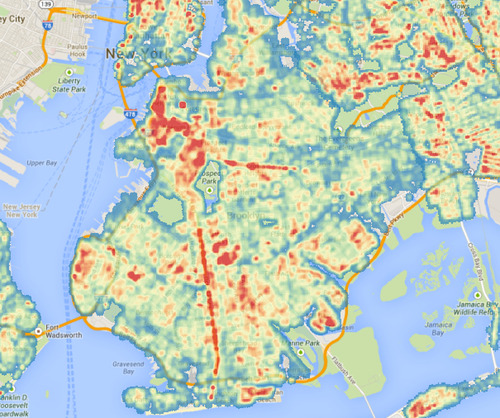

##### Manhattan tree map by original author

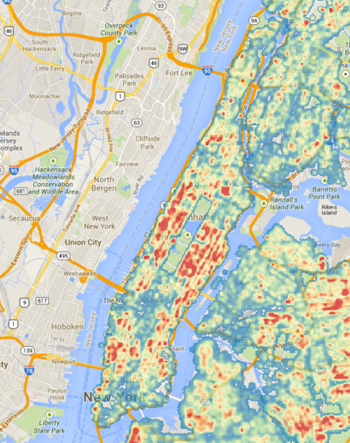

##### Queens tree map by original author

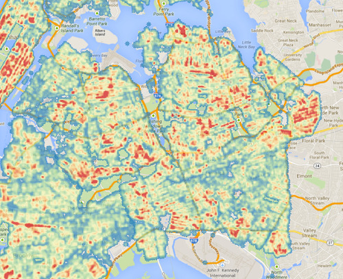

##### Staten Island tree map by original author

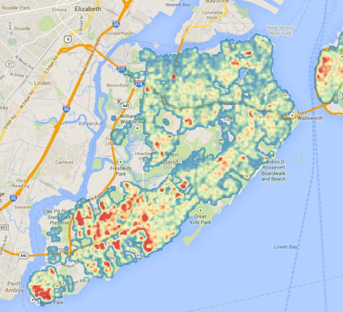

##### Bronx tree map by original author

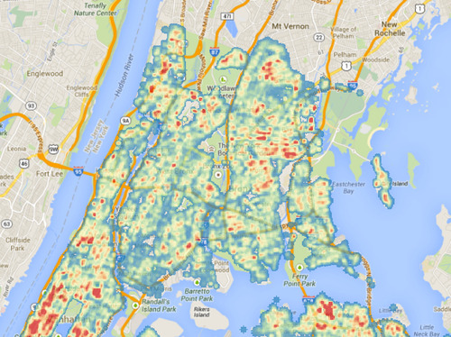

All maps give us a sense of the spatial distribution of trees. Without
the author’s indication of red meaning more trees, however, the reader
is at a loss about what these colors mean since Willington does not
provide a legend. For instance, Willington tells us red means more, but
what of yellow and green? Are readers left to assume in what direction
these colors diverge?

Later in the blog, the author argues that more streets mean more trees,
and to make neighborhoods more comparable, we need to normalize by total
street length. A visualization using this index is not presented to the
readers.

We argue that these maps can be greatly improved.

We propose the following improvements: (1) Since the author wants to
compare across NYC, then there should be a complete map of the city. (2)
The author relies on Neighborhood Tabulation Areas (NTAs) (defined
below) to draw their conclusions, so they should also give the readers a
sense of how these neighborhoods are mapped. (3) Since the author
normalizes by street lengths across neighborhoods, we decided to use
this index for our visualization. Keeping these propositions in mind, we
have crated a new map visualizing tree density

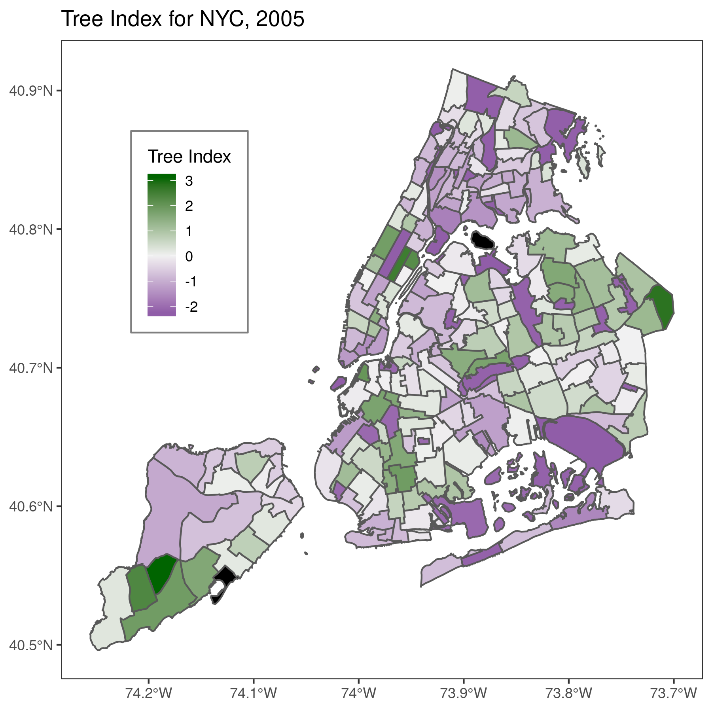

Data Sources: [2005 NYC Tree
Census](https://data.cityofnewyork.us/Environment/2005-Street-Tree-Census/29bw-z7pj)
| [NYC Street
Centerline](https://data.cityofnewyork.us/City-Government/NYC-Street-Centerline-CSCL-/exjm-f27b)
| [Neighborhood Tabulation
Areas](https://data.cityofnewyork.us/City-Government/Neighborhood-Tabulation-Areas-NTA-/cpf4-rkhq)

Our proposed visual includes a legend telling readers areas of low and
high tree densities (purple meaning low, green meaning high, and black
meaning no data), normalized by street lengths. Since this map shows us
all of NYC as opposed to five separate boroughs, this is a simpler way
for the author to begin their argument. According to the author, trees
within parks were not included in the tree census and do not have
streets with which to calculate the index. This is apparent in our
version of the map as Central Park in Manhattan has a darker purple
value, indicating a “low” tree density, when, in fact, this is not
really accurate. One possible solution around this is to include a
different classification for parks in other versions of this map.

### Street/Tree Densities: Highs and Lows

Another data representation the author uses are numeric tables to report
the tree density normalized by street lengths. The tables are shown
below:

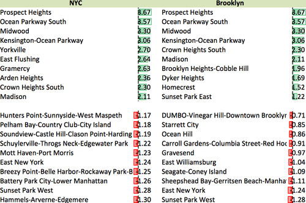

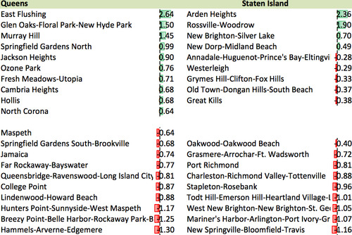

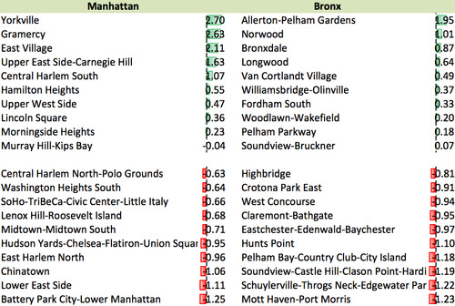

One the one hand, the tables are effective at reporting the actual
numeric values of a measurement. This is especially true since the
author reports the calculated tree index of nearly every NTA. On the
other hand, a bar chart, as we have created below, allows readers to
quickly identify differences among NTAs and boroughs, but only shows a
fraction of the total NTAs. Depending on what the author’s aims are, it
may be more beneficial to include a bar chart versus individual tables.

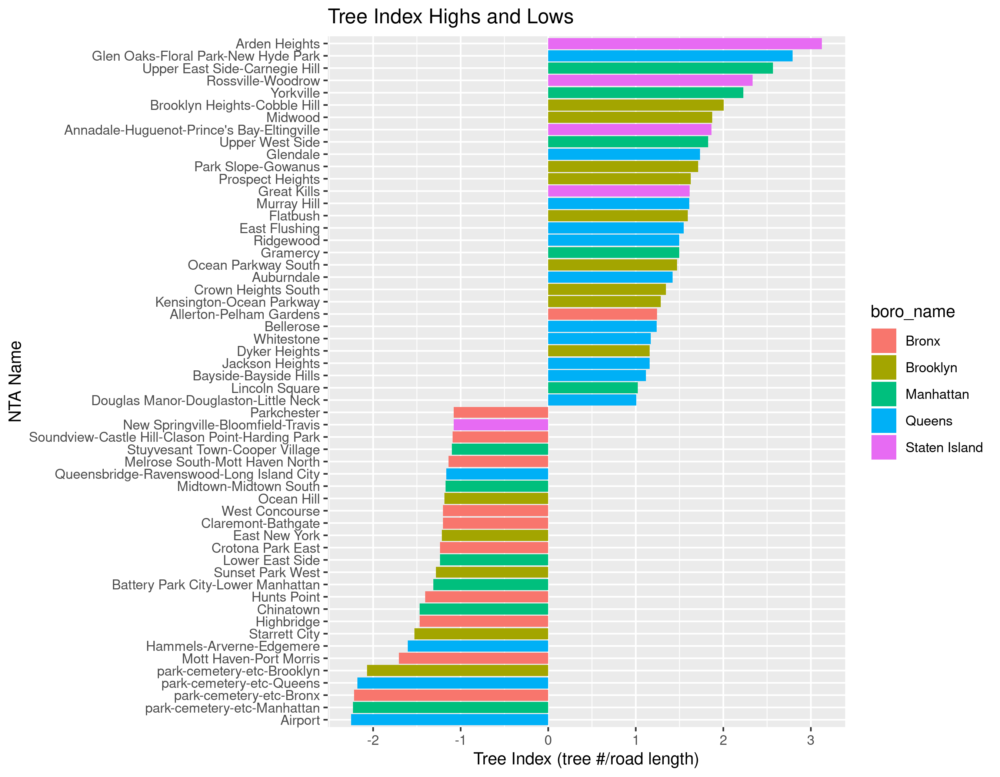 Data Sources: [2005 NYC Tree
Census](https://data.cityofnewyork.us/Environment/2005-Street-Tree-Census/29bw-z7pj)
| [NYC Street
Centerline](https://data.cityofnewyork.us/City-Government/NYC-Street-Centerline-CSCL-/exjm-f27b)

### Correlation between income and street tree index

The author concludes by providing an answer to the blog post’s question
of whether there is a correlation between income and tree density in New
York City. He communicates the correlation results, in a simple column
chart.

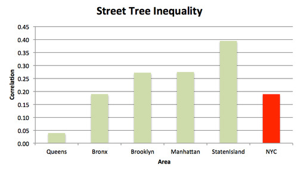

The visualization has minimal [“chart
junk”](https://www.edwardtufte.com/bboard/q-and-a-fetch-msg?msg_id=00040Z)
and is successful at conveying variation in correlation results across
each NYC Borough. But a correlation of what? Isolated reading of the
chart does not convey to readers that the correlation being reported is
between income and the street tree index. Additionally, no coaching is
included to guide the reader as to how to interpret a correlation
result. Since the y axis has been scaled from 0 - 0.45 Staten Island
appears to have a very high correlation which misleads the reader into
concluding a stronger relationship exists than is [supported by the
statistics](https://link.springer.com/article/10.1057/jt.2009.5).

Rather than communicate to the reader a correlation value, we propose to
show the reader a scatterplot that depicts the relationship between the
two values of income and street tree index. The first iteration utilizes
[Tufte’s principle of small
multiples](https://www.edwardtufte.com/bboard/q-and-a-fetch-msg?msg_id=0000hv),
and still organizes by Borough.

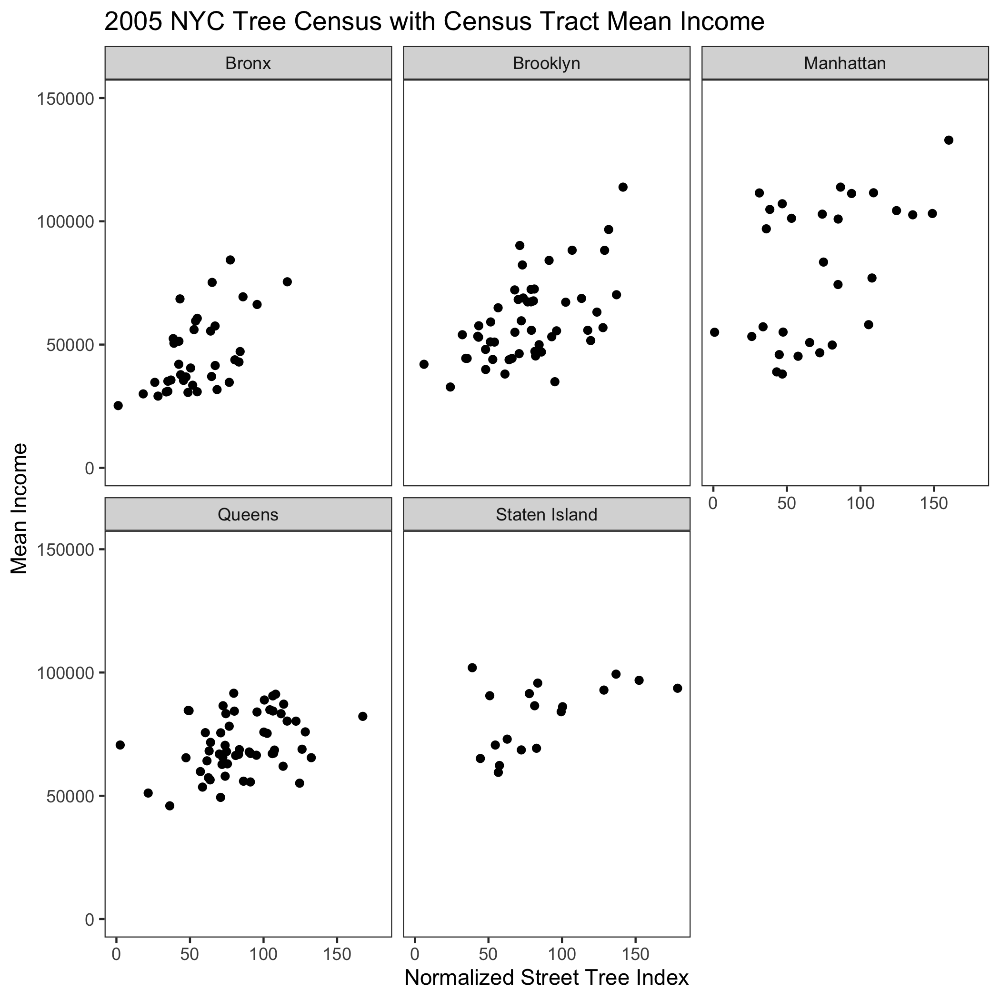

Data Sources: [2005 NYC Tree
Census](https://data.cityofnewyork.us/Environment/2005-Street-Tree-Census/29bw-z7pj)
| [NYC Street
Centerline](https://data.cityofnewyork.us/City-Government/NYC-Street-Centerline-CSCL-/exjm-f27b)
| [ACS 2006 5 year
estimate](https://factfinder.census.gov/faces/tableservices/jsf/pages/productview.xhtml?pid=ACS_10_5YR_B19001&prodType=)
| [Neighborhood Tabulation Area to Census
Tract](https://www1.nyc.gov/site/planning/data-maps/open-data/dwn-nynta.page)

Organizing by Borough is familiar and simplifies the visual story by
reducing the number of data point presented concurrently, but it
distracts the reader from the ultimate question. The question was not
posed to determine if there is greater inequality in the distribution of
trees between Boroughs. The question framed by the blog is to detect
whether a relationship exists in NYC. Framed this way, organizing by
Borough loses relevance. This is partly demonstrated by the random order
the borough categories are expressed on the x axis. They are not ordered
in alphabetical order, spatial order, nor descending order based on the
correlation coefficient. They are just placed on the x axis. We propose
that to best answer the author’s original question, visualizations
should be presented at a more granular level and include the full
spatial region.

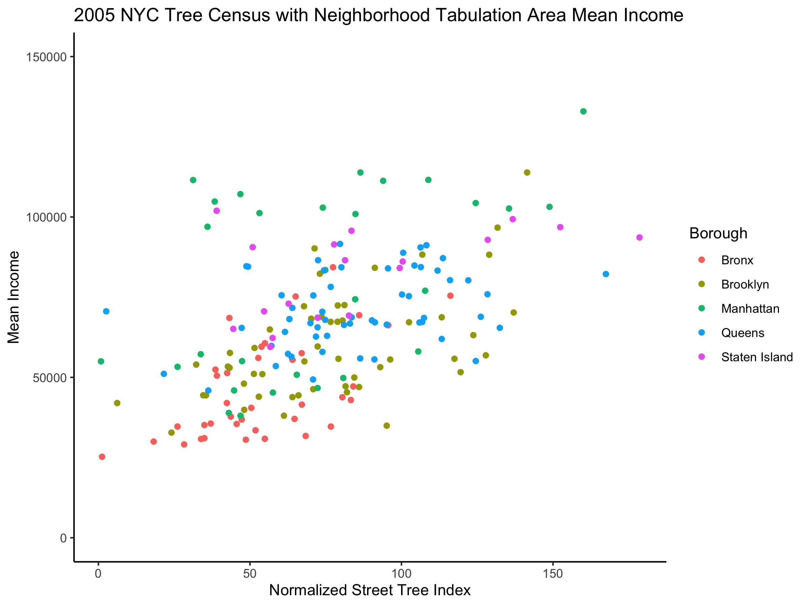

Data Sources: [2005 NYC Tree
Census](https://data.cityofnewyork.us/Environment/2005-Street-Tree-Census/29bw-z7pj)
| [NYC Street
Centerline](https://data.cityofnewyork.us/City-Government/NYC-Street-Centerline-CSCL-/exjm-f27b)
| [ACS 2006 5 year
estimate](https://factfinder.census.gov/faces/tableservices/jsf/pages/productview.xhtml?pid=ACS_10_5YR_B19001&prodType=)
| [Neighborhood Tabulation Area to Census
Tract](https://www1.nyc.gov/site/planning/data-maps/open-data/dwn-nynta.page)

Utilizing this second scatterplot allows the reader to generalize the
correlation trend that may be observed in New York City. Additionally,
because each neighborhood tabulation area is a point, the visualization
enables future research questions to be posed. For instance, what is
occurring in the neighborhoods in the upper left quadrant? These
neighborhoods have above average income, but have low tree density index
scores. Conversely, neighborhood tabulation areas could be highlighted
that have low income but score high on the street tree index.

### Future Visualizations & Directions

Analyzing tree density and the urban forest are relevant topics
frequently receiving attention by
[policymakers](https://www.trilliontrees.org/) and
[academics](https://scholar.google.com/scholar?as_ylo=2016&q=urban+forestry&hl=en&as_sdt=0,34).
The current blog post’s analysis measures tree inequality and infers
that tree additions to equalize the tree index are tangible next steps.
Tree counts are not the only area of concern. The NYC Tree Census data
includes tree condition. Future visualizations should be done to assess
if there is a relationship between income and street tree density
grouped by condition. 2005 tree census data could now also be compared
with the 2015 report to report on changes in density by condition.
[Cloudred](https://www.cloudred.com/labprojects/nyctrees/) has designed
an excelled interactive visualization using the tree census data to
communicate tree species variety by Borough. Another future direction
could be to consider tree species variety at the neighborhood tabulation
area granularity as well as determining if there is a correlation
between income and more varied neighborhood trees.
