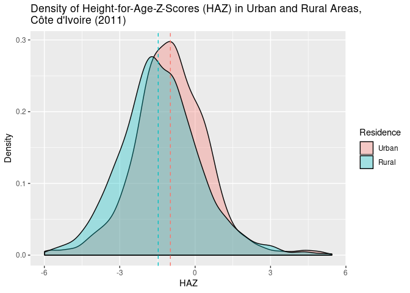
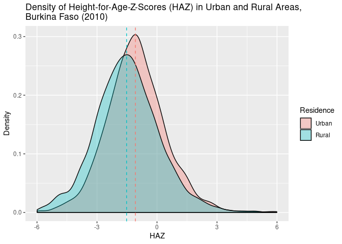
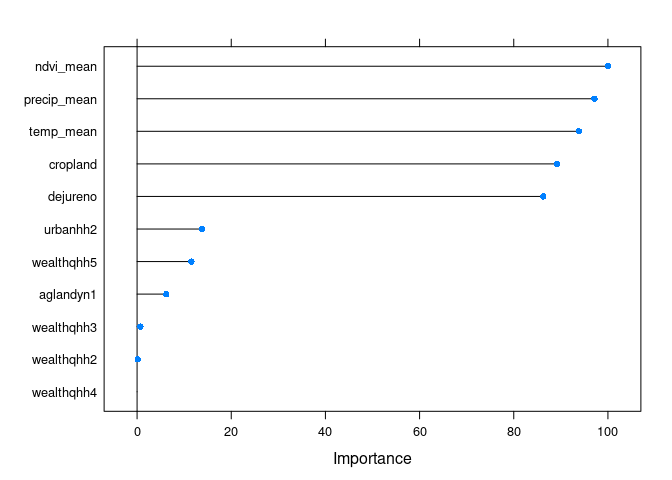

Final Paper
================
Alfredo Rojas
4/27/2020

## Final Project for PLAN 672: Initial Summary

This preliminary project will work towards building a predictive model
for food insecurity indicators in West Africa, using relevant
environmental and household-related variables, as well as relying on a
machine learning approach. This preliminary paper will rely on [DHS-IPUMS](https://www.idhsdata.org/idhs/) (Boyle, King, and Sobek 2019)
survey and environmental data for Ivory Coast and Burkina Faso. For this
specific analysis, the survey data is restricted to 2011 and 2010,
respectively. Since the DHS standardizes all their variables across
survey years, i.e. the variables all have the similar code names for
easy comparison.

One way to measure food insecurity in a region is to look at its
consequences for health. One way to measure these consequences is by
looking at malnutrition in children, which leads to growth faltering, a
popular overall indicator of a child’s health, as well as an indicator
of social inequalities (de Onis and Branca 2016). Growth faltering is
measured in height-for-age z-score (HAZ), where scores below -2 mean
stunted growth. In West and Central Africa, nearly 32% of children are
stunted (UNICEF 2020). Measuring stunting, therefore, is a crucial
avenue to study the drivers of food insecurity.

In this project, I rely on survey data collected through the Demographic
Health Survey (DHS) vaiables related to food security, as well as
contextual variables relating to environmental conditions from IPUMS.
Common variables, according to Gubert, et al. (2010) are: per capital
income, years of schooling, race and gender of HH head, urban/rural
residence, access to public water supply, presence of children, total
number of household inhabitants, and state of residence. In the
DHS-IPUMS data, I have access to:

  - Number of household members
  - Urban/rural household residence
  - Agricultural holdings
  - Wealth index
  - HAZ scores
  - Proportion of cropland within household cluster
  - mean monthly maximum Normalized Difference Vegetation Index (NDVI)
    across, 60 months before and 11 months after survey date
  - mean monthly maximum precipitation across, 60 months before and 11
    months after survey date
  - mean monthly maximum temperature across, 60 months before and 11
    months after survey date

The dependent variable will be HAZ score, while the rest will act as
explanatory variables.

## What is an HAZ score?

Height for weight z-scores, or standard deviation scores, are indices to
measure linear growth potential in children under age 5, where lower
scores (HAZ \< -2) indicate stunting as a result of poor health
conditions and undernutrition (see,
[WHO](https://www.who.int/nutgrowthdb/about/introduction/en/index2.html)
article). While HAZ scores are measured for children at any age under 5
years old, recent research as argued that HAZ scores for children
between 0-23 months should be analyzed separately since the impacts of
malnutrition or any protective factors have not manifested until after
23 months (Alderman and Headey 2018). For the sake of simplicity in this
analsis, I do not differentiate between age. But as I develop this
project, this separation will be necessary.

## Burkina Faso (2010) and Ivory Coast (2011) data

I chose to compare the 2010 and 2011 data for Burkina Faso and Ivory
Coast, respectively. While it should not be underestimated that regional
differences exist between the tropical, Sudanian savanna, and Sahelian
regions going south to north, I do not explicitly account for these
differences in this preliminary stage.

Below, I show all of the GPS points of the sample clusters for these two
surveys. GPS points are randomly offset by approximately 5 to 10
kilometers for rural households to ensure anonymity. Note that the data
includes one erroneous point (perhaps a displaced point) that appears in
the ocean\!

<!-- -->

## Methods

This analysis uses the R statistical programming language to clean,
process, visualize, and analyze the DHS-IPUMS data. The predictive model
will rely on a Random Forest binary classifier, testing the importance
of each explanatory variable in predicting whether a child has an HAZ
score below -2 or not. I rely on the `caret` package to construct the
model. By nature of constructing a binary classifier, I categorized HAZ
scores below -2 as “1” and anything above as “0”.

The environmental variables, like maximum monthly NDVI, precipitation,
and temperature are provided by IPUMS for 60 months before the survey
month and 11 months after. This analysis takes the total average for
these variables. For individual HAZ scores, there are a total of 10,164
observations.

## Looking at the distribution of height for age scores

In general, rural HAZ scores are lower than urban HAZ scores for both
Ivory Coast and Burkina Faso. Overall, median HAZ scores are below zero.
In the charts below, I provide probability density graphs to examine the
general distribution of scores across rural and urban
areas.

<!-- -->

<!-- -->

## Looking at the distribution for proportion of crop land around clusters

Another consideration is to explore the amount of cropland that exists
around survey sites across urban and rural areas. As would be expected,
the mean proportion of cropland is lower in urban areas than in rural
areas. However, the rural and urban distributions are very different for
Ivory Coast than for Burkina Faso. Ivory Coast’s distribution for rural
areas seems to gravitate around the mean, whereas in the urban
distribution you find more distinct peaks. In Burkina Faso’s
distribution, both urban and rural seem to follow a similar pattern.

<!-- -->

<!-- -->

## The Random Forest classifier

Below is the code and the results for the random forest classifier.

``` r
library(caret)

# combine datasets, ensure categorical variables are factors
data_ready <- rbind(ci_clean, bf_clean) %>%
  select(-c("hwchazwho")) %>%
  zap_label()

data_ready$urbanhh <- as.factor(data_ready$urbanhh)
data_ready$aglandyn <- as.factor(data_ready$aglandyn)
data_ready$wealthqhh <- as.factor(data_ready$wealthqhh)
data_ready$stunting <- as.factor(data_ready$stunting)

# create index to get training and test samples
train_index <- createDataPartition(data_ready$stunting, p=0.80, list=FALSE)
test_dataset <- data_ready[-train_index,]
train_dataset <- data_ready[train_index,]

set.seed(12)
control <- trainControl(method ="repeatedcv", 
                        repeats = 3, 
                        classProbs = F, # classProbs = F avoids the error of syntactically valid names
                        summaryFunction = multiClassSummary)        # I don't understand, though

rf_haz <- train(stunting ~ ., 
                data = train_dataset, 
                method = "rf", 
                trControl = control, 
                preProcess = c("center", "scale"))

haz_predict <- predict(rf_haz, test_dataset)
confusionMatrix(factor(haz_predict), factor(test_dataset$stunting)) # gives error: the data cannot have more levels than the reference
```

    ## Confusion Matrix and Statistics
    ## 
    ##           Reference
    ## Prediction    0    1
    ##          0 1342  645
    ##          1   28   17
    ##                                           
    ##                Accuracy : 0.6688          
    ##                  95% CI : (0.6479, 0.6893)
    ##     No Information Rate : 0.6742          
    ##     P-Value [Acc > NIR] : 0.7076          
    ##                                           
    ##                   Kappa : 0.0069          
    ##                                           
    ##  Mcnemar's Test P-Value : <2e-16          
    ##                                           
    ##             Sensitivity : 0.97956         
    ##             Specificity : 0.02568         
    ##          Pos Pred Value : 0.67539         
    ##          Neg Pred Value : 0.37778         
    ##              Prevalence : 0.67421         
    ##          Detection Rate : 0.66043         
    ##    Detection Prevalence : 0.97785         
    ##       Balanced Accuracy : 0.50262         
    ##                                           
    ##        'Positive' Class : 0               
    ## 

Overall, the accuracy of the model is not great, around 67%. According
to the below graph, the most important variables were many of the
environmental variables, like NDVI, precipitation, temperature, and
amount of cropland. Sensitivity to environmental variables is consistent
with literature exploring these associations between climate and
childhood health (Bakhtsiyarava, Grace, and Nawrotzki 2018). These
results indicate that more consideration needs to be taken when
constructing this model, perhaps taking childhood age in relation to HAZ
score as a consideration (Alderman and Heady 2018).

<!-- -->

    ## 
    ## Call:
    ##  randomForest(x = x, y = y, mtry = param$mtry) 
    ##                Type of random forest: classification
    ##                      Number of trees: 500
    ## No. of variables tried at each split: 2
    ## 
    ##         OOB estimate of  error rate: 32.55%
    ## Confusion matrix:
    ##      0  1 class.error
    ## 0 5397 86  0.01568484
    ## 1 2561 88  0.96677992

Associations can be seen between HAZ and mean temperature, as well as
between HAZ and mean NDVI. Maximum temperature extremes seems to have a
negative impact on HAZ scores, where higher NDVI values correlates
somewhat with positive HAZ
scores.

<!-- --><!-- -->

## Concluding remarks

In this project, I explored factors driving childhood stunting using
DHS-IPUMS data to move toward a predictive model of low HAZ scores.
Overall, the Random Forest binary classifier was 67% accurate.
Performance may be imporved if HAZ scores were distinguished by age
groups,if environmental data were aggregated differently, and if other
relevant variables were included. As is consistent with current
literature on climate and child nutrition, many of the environmental
variables had high levels of importance for the classifier.

## References

Alderman, Harold, and Derek Headey. 2018. “The Timing of Growth
Faltering Has Important Implications for Observational Analyses of the
Underlying Determinants of Nutrition Outcomes.” PLOS ONE 13 (4):
e0195904. <https://doi.org/10.1371/journal.pone.0195904>.

Bakhtsiyarava, Maryia, Kathryn Grace, and Raphael J. Nawrotzki. 2017.
“Climate, Birth Weight, and Agricultural Livelihoods in Kenya and
Mali.” American Journal of Public Health 108 (S2): S144–50.
<https://doi.org/10.2105/AJPH.2017.304128>.

Boyle, Elizabeth Heger, Miriam King and Matthew Sobek. IPUMS-Demographic and Health Surveys: Version 7 [dataset]. Minnesota Population Center and ICF International, 2019. 
<https://doi.org/10.18128/D080.V7>

Gubert, Muriel Bauermann, and Maria Helena D’Aquino Benício. 2010. “Use
of a Predictive Model for Food Insecurity Estimates in Brazil.” Archivos
Latinoamericanos De Nutricion 7.

Onis, Mercedes de, and Francesco Branca. 2016. “Childhood Stunting: A
Global Perspective.” Maternal & Child Nutrition 12 (S1): 12–26.
<https://doi.org/10.1111/mcn.12231>.

UNICEF. 2020. Source:
<https://data.unicef.org/topic/nutrition/malnutrition/>
