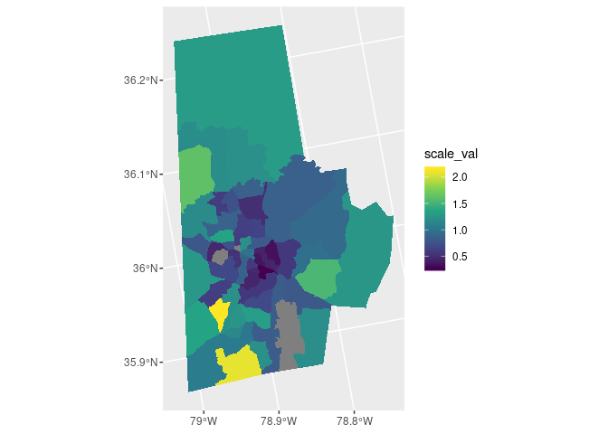
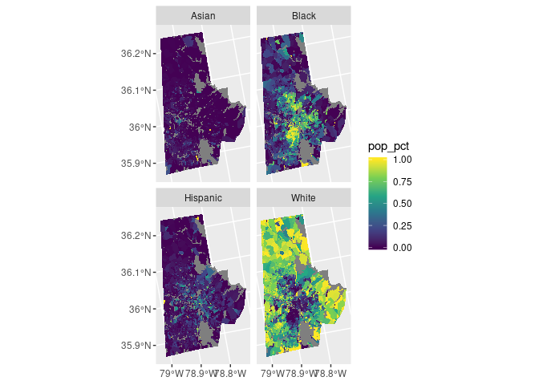
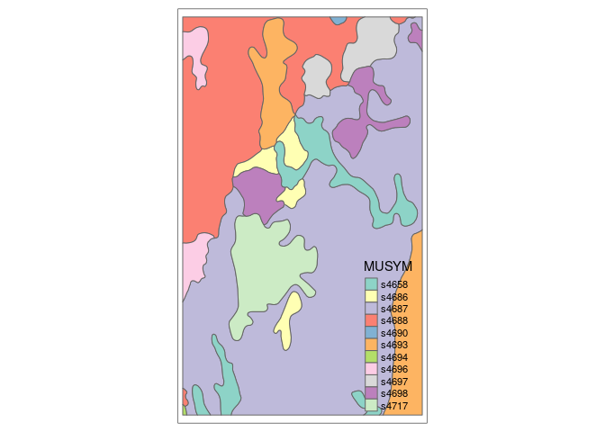
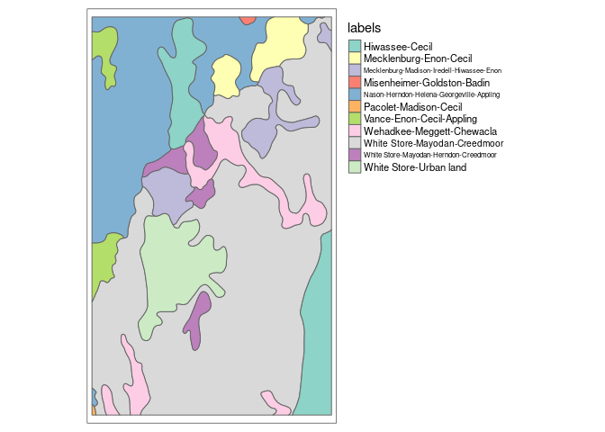
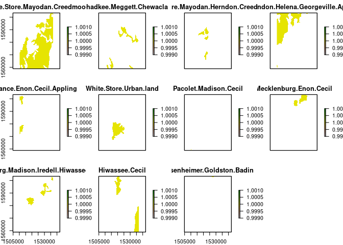

Homework 6: Land Suitability Analysis
================
Alfredo Rojas
3/27/2020

## Land suitability analysis for Durham County.

Objective: Deciding where a landfill should go.

Since landfilles are unwanted forms of land use, figuring out where one
should be placed is often contentious. In this imagined example, I will
build on Nikhil Kaza’s
[tutorial](http://sia.planning.unc.edu/post/2020-03-06-land-suitability-analysis/land-suitabilty-with-ahp-wlc/)
on land suitability analysis. This assignment builds on his analysis by
including indicators of environmental justice and other environmental
criteria. These criteria are:

1)  Do not disproportionately expose minority communities to
    environmental hazards
2)  Avoid putting hazardous sites near protected areas
3)  Looking at soil types best suitable for landfills

I learned how to get ACS income data and visualizing it with the help of
Kyle Walker’s
[tutorial](https://walkerke.github.io/tidycensus/articles/spatial-data.html).

``` r
library(raster)
library(rasterVis)
library(here)
library(tidyverse)
library(knitr)
library(kableExtra)
library(fasterize)
library(sf)
library(tmap)
library(tidycensus)
library(RColorBrewer)

# From Nikhil Kaza's blog, he uses this template raster as a basis to analyze other datasets. 
lulc_data <- raster("land_suit/c11_37063.img")
template_raster <- reclassify(lulc_data, cbind(0, 100, 0), right=FALSE)
project_crs <- crs(lulc_data)

# explore tidycensus variables
# v18 <- load_variables(2018, data = "acs5", cache = TRUE)

# bring other data for suitability analsyis
durham_tract <- tidycensus::get_acs(geography = "tract",
                                    variables = "B19013_001",
                                    state = "NC",
                                    county = "Durham",
                                    geometry = T)

durham_tract <- st_transform(durham_tract, crs=project_crs) 

# Look at scaled income across Durham county tracts
durham_tract %>% 
  mutate(scale_val = scale(estimate, center = F)) %>%
  ggplot(aes(fill = scale_val)) +
  geom_sf(color = NA) +
  scale_fill_viridis_c()
```

<!-- -->

Look at race and ethnicity distribution of Durham county. Because I can
get this data from the decennial census, I can visualize this by census
blocks.

``` r
# get variables for race and ethnicity population counts
race_code <- c(White = "P005003",
               Black = "P005004",
               Asian = "P005006",
               Hispanic = "P004003")

durham_blocks <- tidycensus::get_decennial(geography = "block",
                                           variables = race_code,
                                           year = "2010",
                                           state = "NC",
                                           county = "Durham",
                                           geometry = TRUE,
                                           summary_var = "P001001")

durham_blocks <- st_transform(durham_blocks, crs = project_crs)

durham_blocks %>% 
  mutate(pop_pct = value / summary_value) %>%
  ggplot(aes(fill = pop_pct)) +
  facet_wrap(~variable) +
  geom_sf(color = NA) +
  scale_fill_viridis_c()
```

<!-- -->

Perhaps one angle we can take is to ensure that minority communities are
not put at disproportionate risk of exposure to environmental
contaminants. Racial disparities in exposure to environmental risks is
termed [environmental
racism](https://www.theatlantic.com/politics/archive/2018/02/the-trump-administration-finds-that-environmental-racism-is-real/554315/)
and has been evidenced in cases of lead poisoning and particulate matter
in the air affecting minority communities more than wealthier
predominantly white communities. See also this [interactive
article](http://www.msnbc.com/interactives/geography-of-poverty/se.html)
on poverty and environmental injustice in the the American South.

## Protected Areas Database

``` r
# read in protected are designation
# pad_data = st_read("pad_nc/PADUS2_0Designation_NC.shp") %>%
#   st_as_sf()
# 
# p1 <- tm_shape(pad_data) +
#   tm_polygons("Mang_Type")
# 
# project and clip to Durham
# pad_clip <- pad_data %>%
#   st_transform(project_crs) %>%
#   st_crop(st_bbox(lulc_data))
# 
# st_write(pad_clip, paste0(getwd(), "/", "land_suit", "/", "pad_durham.shp"))
```

Clip PAD data to Durham County. Just to visuzlize where these protected
areas are spatially, I’ll plot it against the Durham tract-level
data.

``` r
# using subset of data created for this specific purpose (code commented out above)
pad_clip <- st_read("land_suit/pad_durham.shp")
```

    ## Reading layer `pad_durham' from data source `/mnt/rstudio/home/alfredoj/lab6_raster/land_suit/pad_durham.shp' using driver `ESRI Shapefile'
    ## Simple feature collection with 15 features and 41 fields
    ## geometry type:  MULTIPOLYGON
    ## dimension:      XY
    ## bbox:           xmin: 1513277 ymin: 1558875 xmax: 1536975 ymax: 1592244
    ## epsg (SRID):    NA
    ## proj4string:    +proj=aea +lat_1=29.5 +lat_2=45.5 +lat_0=23 +lon_0=-96 +x_0=0 +y_0=0 +ellps=GRS80 +units=m +no_defs

``` r
p1 <- tmap::tm_shape(durham_tract) +
  tm_polygons(col = NA)

p2 <- tmap::tm_shape(pad_clip) +
  tm_polygons("Mang_Type") 

p1 + p2
```

    ## Warning: The shape pad_clip is invalid. See sf::st_is_valid

<!-- -->

One criteria that we can strive for is that the landfill be sufficiently
far away from protected areas. Following, Nikhil Kaza’s
[blog](http://sia.planning.unc.edu/post/2020-03-06-land-suitability-analysis/land-suitabilty-with-ahp-wlc/),
we can convert the polygon data into raster, and determine different
distances from locations of interest using the `gridDistance()`
function.

``` r
pad_ras <- pad_clip %>%
  fasterize(raster = template_raster) %>%
  gridDistance(origin = 1) %>%
  mask(lulc_data) %>% # Creates new raster that has the same values as lulc_data, except for the cells that are NA (or other maskvalue) in a 'mask'.
  reclassify(rcl = matrix(c(0,500,1, 500,1000,2, 1000,2000,3, 2000,4000,4, 4000,Inf,5), ncol=3, byrow = T), 
             include.lowest=T)
```

    ## Loading required namespace: igraph

``` r
pad_ras %>% ratify %>% levelplot(att="ID", main = "Distance from PAD", col.regions=brewer.pal(6, "PuBu"))
```

<!-- -->

## Soils

Another domain land suitability analysis has a role is looking at the
kinds of soils in an area to see what soil type is best suited for the
specific land use. We are able to achieve this by using [soil
data](https://nrcs.app.box.com/v/soils) from the National Resources
Conservation
Service.

``` r
# nc_soil <- st_read("soils/wss_gsmsoil_NC_[2016-10-13]\\spatial\\gsmsoilmu_a_nc.shp") %>% 
#   st_as_sf() %>%
#   st_transform(project_crs) %>%
#   st_crop(st_bbox(lulc_data))
# 
# st_write(nc_soil, paste0("land_suit", "/", "durham_soil.shp"))

dur_soil <- st_read("land_suit/durham_soil.shp")
```

    ## Reading layer `durham_soil' from data source `/mnt/rstudio/home/alfredoj/lab6_raster/land_suit/durham_soil.shp' using driver `ESRI Shapefile'
    ## Simple feature collection with 21 features and 4 fields
    ## geometry type:  MULTIPOLYGON
    ## dimension:      XY
    ## bbox:           xmin: 1510215 ymin: 1558875 xmax: 1536975 ymax: 1603365
    ## epsg (SRID):    NA
    ## proj4string:    +proj=aea +lat_1=29.5 +lat_2=45.5 +lat_0=23 +lon_0=-96 +x_0=0 +y_0=0 +ellps=GRS80 +units=m +no_defs

``` r
tmap::tm_shape(dur_soil) +
  tm_polygons("MUSYM")
```

<!-- -->

The MUSYM labels have to changed to identify soil types. We can do that
with the below code, using one of the .txt documents that came with the
original dataset:

``` r
# create lookup table for durham
# soil_codes <- unique(dur_soil$MUSYM)
# lookup_table <- read_delim("soils/wss_gsmsoil_NC_[2016-10-13]\\tabular\\mapunit.txt", 
#                           col_names = FALSE, delim = "|", skip_empty_rows = TRUE) %>% 
#   dplyr::select(X1, X2) %>%
#   filter(X1 %in% as.character(soil_codes))

# save for later:
# write_csv(lookup_table, "land_suit/lookup_table.csv")
#test
lookup_table <- read_csv("land_suit/lookup_table.csv")
```

    ## Parsed with column specification:
    ## cols(
    ##   X1 = col_character(),
    ##   X2 = col_character()
    ## )

``` r
# creates vectors from tibble
soil_names <- pull(lookup_table[,2]) %>%
  str_replace(" \\(.*\\)", "")

code_lookup <- pull(lookup_table[,1])

# add labels
count <- 1
dur_soil$labels <- NA
for(i in code_lookup){
  dur_soil[dur_soil$MUSYM == i, ]$labels <- soil_names[count]
  count <- count + 1
}

# plot with labels
tmap::tm_shape(dur_soil) +
  tm_polygons("labels") +
  tm_layout(legend.outside = T)
```

    ## Some legend labels were too wide. These labels have been resized to 0.46, 0.47, 0.63, 0.49. Increase legend.width (argument of tm_layout) to make the legend wider and therefore the labels larger.

<!-- -->

Now that we have labeled soil data, we can perform similar raster
operations on this dataset in order to incorporate this into similar
raster operations we’ve done.

``` r
soil_ras <- dur_soil %>%
  fasterize(raster = template_raster, by = "labels")

plot(soil_ras)
```

<!-- -->

With this, we are now able to identify which soil levels are most
suitable for a land fill and select that raster layer for further land
suitability analysis.
