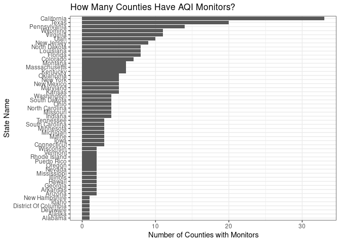
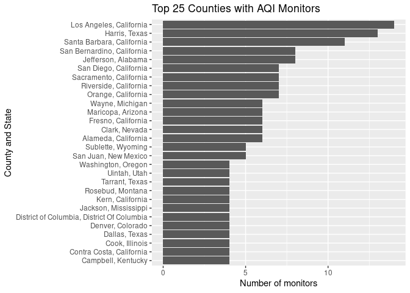

PLAN 672 Homework 2: NO2 Analysis
================
Alfredo Rojas
1/20/2020

## Exploring Discrepencies in \(NO_2\) Monitors from EPA Ambient Air Quality Monitoring Program

According to the
[EPA](https://www.epa.gov/no2-pollution/basic-information-about-no2#What%20is%20NO2),
\(NO_{2}\) (or Nitrogen Dioxide) is a nitrous oxide, \(NO_{x}\), which
is a group of highly reactive gasses that gets into the air from burning
fuels. This pollutant can come from emissions from cars, trucks, power
plants, and off-road equipment. The EPA has monitors around the country
to deliver an Air Quality Index (AQI) value for a particular county. AQI
values over 100 could indicate pollutant levels that are a risk to those
with respiratory problems. However, not all states are covered by these
monitors equally.

This assignment covers steps to process and analyze data from EPA’s air
quality monitoring program. Specifically, this analysis looks at
\(NO_{2}\) data collected from sensors across the United States in 2017
and where such measurements take place. The primary questions this
article hopes to answer is: (1) Where do monitors exist? and (2) What
are the differences in terms of their quantity across states?

``` r
library(tidyverse)
library(dplyr)
library(plotly)
library(tmaptools)
# read in data
path_to_file = file.path("data", "daily_42602_2017.csv")
data_no2 = read_csv(path_to_file)
```

Let us explore the structure of this
    data

``` r
dim(data_no2)
```

    ## [1] 154876     29

``` r
names(data_no2)
```

    ##  [1] "State Code"          "County Code"         "Site Num"           
    ##  [4] "Parameter Code"      "POC"                 "Latitude"           
    ##  [7] "Longitude"           "Datum"               "Parameter Name"     
    ## [10] "Sample Duration"     "Pollutant Standard"  "Date Local"         
    ## [13] "Units of Measure"    "Event Type"          "Observation Count"  
    ## [16] "Observation Percent" "Arithmetic Mean"     "1st Max Value"      
    ## [19] "1st Max Hour"        "AQI"                 "Method Code"        
    ## [22] "Method Name"         "Local Site Name"     "Address"            
    ## [25] "State Name"          "County Name"         "City Name"          
    ## [28] "CBSA Name"           "Date of Last Change"

``` r
head(data_no2)
```

    ## # A tibble: 6 x 29
    ##   `State Code` `County Code` `Site Num` `Parameter Code`   POC Latitude
    ##   <chr>        <chr>         <chr>                 <dbl> <dbl>    <dbl>
    ## 1 01           073           0023                  42602     1     33.6
    ## 2 01           073           0023                  42602     1     33.6
    ## 3 01           073           0023                  42602     1     33.6
    ## 4 01           073           0023                  42602     1     33.6
    ## 5 01           073           0023                  42602     1     33.6
    ## 6 01           073           0023                  42602     1     33.6
    ## # … with 23 more variables: Longitude <dbl>, Datum <chr>, `Parameter
    ## #   Name` <chr>, `Sample Duration` <chr>, `Pollutant Standard` <chr>,
    ## #   `Date Local` <date>, `Units of Measure` <chr>, `Event Type` <chr>,
    ## #   `Observation Count` <dbl>, `Observation Percent` <dbl>, `Arithmetic
    ## #   Mean` <dbl>, `1st Max Value` <dbl>, `1st Max Hour` <dbl>, AQI <dbl>,
    ## #   `Method Code` <dbl>, `Method Name` <chr>, `Local Site Name` <chr>,
    ## #   Address <chr>, `State Name` <chr>, `County Name` <chr>, `City
    ## #   Name` <chr>, `CBSA Name` <chr>, `Date of Last Change` <date>

We need to create the 5-digit FIPS code using the already-included State
and County Codes. This code chunk is a modified version of code from
Nikhil Kaza’s
[tutorial](https://sia.planning.unc.edu/post/2018-07-26-introduction-to-r-exploratory-data-visualisation/exploratory-data-analysis-visualisation/)

``` r
# create fips
data_no2$st_cty_fips = paste(formatC(data_no2$`State Code`, width = 2, flag = "0"), 
                             formatC(data_no2$`County Code`, width = 3, flag ="0"),
                             sep = "")

# Select columns that are most relevant, and we can rename them at the same time
no2_subset = data_no2 %>%
  select('st_cty_fips', site_num = 'Site Num',lat = 'Latitude', long = 'Longitude', 
         date_loc = 'Date Local', state_name = 'State Name', 
         county_name = 'County Name', cbsa_name = 'CBSA Name', 'AQI') %>%
  mutate(SiteID = paste(st_cty_fips, site_num, sep = "_"))

# see how many unique observations there are
no2_subset$st_cty_fips %>% 
  unique() %>%
  length()
```

    ## [1] 257

``` r
# check to see if it's the same as original dataset. . .   
data_no2$st_cty_fips %>%
  unique() %>%
  length()
```

    ## [1] 257

``` r
# observe highest to lowest: Michigan, California, and Puerto Rico in the top 3
arrange(no2_subset, desc(AQI)) %>%
  head(n = 10)
```

    ## # A tibble: 10 x 10
    ##    st_cty_fips site_num   lat   long date_loc   state_name county_name
    ##    <chr>       <chr>    <dbl>  <dbl> <date>     <chr>      <chr>      
    ##  1 26163       1010      42.3  -83.1 2017-10-06 Michigan   Wayne      
    ##  2 06001       0013      37.9 -122.  2017-12-15 California Alameda    
    ##  3 06037       4008      33.9 -118.  2017-10-24 California Los Angeles
    ##  4 72025       0007      18.2  -66.1 2017-09-01 Puerto Ri… Caguas     
    ##  5 06037       1302      33.9 -118.  2017-10-24 California Los Angeles
    ##  6 06037       4008      33.9 -118.  2017-12-06 California Los Angeles
    ##  7 49035       3013      40.5 -112.  2017-09-15 Utah       Salt Lake  
    ##  8 06071       0027      34.0 -118.  2017-08-29 California San Bernar…
    ##  9 09009       0027      41.3  -72.9 2017-06-13 Connectic… New Haven  
    ## 10 06037       4008      33.9 -118.  2017-12-07 California Los Angeles
    ## # … with 3 more variables: cbsa_name <chr>, AQI <dbl>, SiteID <chr>

``` r
natl_100 = no2_subset %>%
  group_by(st_cty_fips, date_loc, SiteID) %>%
  summarise(n = n(),
            gt100 = AQI >= 100, 
            state = first(state_name),
            county = first(county_name),
            Latitude = lat,
            Longitude = long
            ) %>%
  filter(gt100 == TRUE)
```

## Create summaries

We can use `group_by()` and `summarise()` to create some summary
statistics. We can even focus on a specific state. Because I am from
Florida, I will be exploring AQI values across Florida first.

``` r
florida_no2 = no2_subset %>%
  filter(state_name == "Florida") %>%
  group_by(st_cty_fips, date_loc, SiteID) %>%
  summarise(n = n(),
            maxAQI = max(AQI), 
            state = first(state_name),
            county = first(county_name)
            )
```

Now, we can take these summary statistics and create some plots

``` r
florida_no2 %>% ggplot(mapping = aes(x = date_loc, y = maxAQI)) +
  geom_point(alpha = 1/3, color = "navy") +
  facet_wrap(~county) +
  labs(title = "Air Quality Index for Maximum NO2 values in Florida, 2017",
       subtitle = "(Observations represent one day)",
       x = "Month",
       y = "Max AQI") +
  theme_bw() +
  scale_x_date(date_labels = "%b")
```

<!-- -->

It seems as if the highest \(NO_2\) Values occur in the first and last
parts of the year. Perhaps this is due to Florida’s tourism industry
where many people travel to the state during the winter time. Also, we
can by the darker portions of the graph that multiple measurements have
been taken on the same day or in close temporal proximity to one
another. Let’s try the same visualizaiton for North Carolina.

``` r
# summary and plot for North Carolina
nc_no2 = no2_subset %>%
  filter(state_name == "North Carolina") %>%
  group_by(st_cty_fips, date_loc, SiteID) %>%
  summarise(n = n(),
            maxAQI = max(AQI), 
            state = first(state_name),
            county = first(county_name)
            )

nc_no2 %>% ggplot(mapping = aes(x = date_loc, y = maxAQI)) +
  geom_point(alpha = 1/3, color = "navy") +
  facet_wrap(~county) +
  labs(title = "Air Quality Index for Maximum NO2 values in North Carolina, 2017",
       subtitle = "(Observations represent one day)",
       x = "Month",
       y = "Max AQI") +
  theme_bw() +
  scale_x_date(date_labels = "%b")
```

<!-- -->

One thing to note from these two plots is not all counties have
monitors. So we can already start questioning to what extent areas with
\(NO_{2}\) measurements are representative of a particular state or
region. Additionally, due to the dark clusters of points, it seems like
there are higher concentrations of observations per day/month in Florida
than in North Carolina.

Now, let’s look at California.

``` r
# summary and plot for california
cal_no2 = no2_subset %>%
  filter(state_name == "California") %>%
  group_by(st_cty_fips, date_loc, SiteID) %>%
  summarise(n = n(),
            maxAQI = max(AQI), 
            state = first(state_name),
            county = first(county_name)
            )

# Point data is kind of overwhleming, try using
cal_no2 %>% ggplot(mapping = aes(x = date_loc, y = maxAQI)) +
  geom_point(size = 0.4, alpha = 1/3, color = "navy") +
  facet_wrap(~county) +
  labs(title = "Air Quality Index for Maximum NO2 values in California, 2017",
       subtitle = "(Observations represent one day)",
       x = "Month",
       y = "Max AQI") +
  theme_bw() +
  scale_x_date(date_labels = "%b")
```

<!-- -->

Some states, like California, are much more well-documented than other
states. We can see that places who have known pollution problems, like
Los Angeles, show observations with AQI values greater than 100.

The amount of counties monitoried in California is much higher than
North Carolina and Florida. Next, I will explore these discrepencies on
a national level.

``` r
# take original data and group_by states to count counties
nat_sum = no2_subset %>%
  group_by(state_name) %>%
  summarise(
    n = n(),
    n_cnty_mntrs = length(unique(county_name)),
    num_mntrs = length(unique(SiteID))
  )

# use geom_col. Unlike defaults in geom_bar, it leaves data as it is 
nat_sum %>% ggplot(mapping = aes(x = reorder(state_name, n_cnty_mntrs), y = n_cnty_mntrs)) +
  geom_col() + 
  coord_flip() +
  labs(title = "How Many Counties Have AQI Monitors?",
       x = "State Name",
       y = "Number of Counties with Monitors") +
  theme_bw() +
  theme(text = element_text(size = 11))
```

<!-- -->

There seem to be big discrepencies among states and the presence of AQI
monitors within counties. Maybe California has more monitors because it
is a big state. Could this explain the discrepencies we see? Does this
discrepency still make sense when we look at the total of counties for
each state in general? We can begin to answer these questions. But we
can’t just compare raw data, since some states are bigger than others
and this may mean there are more counties by nature of that fact. After
looking at raw values, we’ll normalize the amount of counties with
monitors by the total amount of counties per state. This allows us to
compare states evenly.

``` r
# download fips, county, and state data; from tigris package
library(tigris)
```

    ## To enable 
    ## caching of data, set `options(tigris_use_cache = TRUE)` in your R script or .Rprofile.

    ## 
    ## Attaching package: 'tigris'

    ## The following object is masked from 'package:graphics':
    ## 
    ##     plot

``` r
data(fips_codes)
names(fips_codes)

# combine state and county codes
fips_codes$st_cty_fips = paste(formatC(fips_codes$state_code, width = 2, flag = "0"), 
                             formatC(fips_codes$county_code, width = 3, flag ="0"),
                             sep = "")

# get total number of counties per state
smmry_ctys = fips_codes %>%
  group_by(state_name) %>%
  summarise(n = n(),
            num_county = length(unique(county))
            )

# plot the number of overall counties in each U.S. state
smmry_ctys %>% ggplot(mapping = aes(x = reorder(state_name, num_county), y = num_county)) +
  geom_col() + 
  coord_flip() +
  labs(title = "How Many Counties in U.S.?",
       x = "State Name",
       y = "Number of Counties") +
  theme_bw() +
  theme(text = element_text(size = 11))
```

<!-- -->

In the above graph, we see that California is in the middle in terms of
the number of counties it contains. This is somewhat in contrast with
the relatively large amount of counties in California containing AQI
monitors. California, then, seems to have disproportionately more
counties with AQI monitors than other states. For example, consider
Georgia. It has second most coutnies in the entire country, but has very
few counties with AQI monitors.

Now, let’s normalize the number of counties with monitors by the number
counties per state. This will allow us to compare equally the percentage
of a state that is covered by monitors to quantify discrepencies more
accurately and fairly.

``` r
# change capitalization of "Of" in nat_sum so left_join() works
nat_sum[9, 1] = c("District of Columbia") 

# combine AQI table with fips table for comparison
smmry_all = nat_sum %>%
  left_join(smmry_ctys, by = "state_name") %>%
  mutate(percent = n_cnty_mntrs/num_county)

# Visualize percentages across state
smmry_all %>% ggplot(mapping = aes(x = reorder(state_name, percent), y = percent)) +
  geom_col() +
  coord_flip() +
  labs(title = "Percentage of Counties with Monitors by State",
       x = "State Name",
       y = "Percentage of Counties Covered") +
  theme_bw() +
  theme(text = element_text(size = 10))
```

<!-- -->

We can see now how states compare to one another in terms of monitor
coverage. Note that District of Columbia has 100% of its counties
covered because there is only one county: the District of Columbia
itself. Perhaps more interesting, half of the counties in California and
Wyoming have monitors, while much less of other U.S. states have
monitors.

We can also look at which counties across the U.S. have the most
monitors and those that have the least.

``` r
# group by counties, quantify unique SiteIDs per coutny
byCounties = no2_subset %>% 
  group_by(county_name) %>%
  summarise(
    n = n(), # number of total observations per county
    state = first(state_name), 
    no_mntrs = length(unique(SiteID))
  )

# find the top 25 counties with the most monitors
byCounties %>% top_n(25, no_mntrs) %>%
  ggplot(mapping = aes(x = reorder(paste(county_name, state, sep = ", "), no_mntrs), 
                       y = no_mntrs)) +
  geom_col() + 
  coord_flip() +
  labs(title = "Top 25 Counties with AQI Monitors",
       y = "Number of monitors",
       x = "County and State"
  )
```

<!-- -->

Next, I will create a map with all of the monitors represented as
circles and counties that have reported an AQI value of more than 100.

``` r
monitor_loc = unique(no2_subset[,c("long", "lat")]) %>%
  rename(Longitude = long, Latitude = lat)

library(leaflet)
map <-  leaflet(monitor_loc) %>%
  addProviderTiles(providers$Stamen.TonerLines, group = "Basemap") %>%
  addProviderTiles(providers$Stamen.TonerLite, group = "Basemap") %>%
  addCircles(group = "Monitors") %>%
  addMarkers(data = natl_100, lng = ~ Longitude, lat = ~ Latitude, group = "Over 100 AQI in 2017") %>%
  addLayersControl(
    overlayGroups = c("Monitors", "Over 100 AQI in 2017"),
    options = layersControlOptions(collapsed = FALSE)
  )

map
```

<!-- -->

With this final, interactive visualization, we can see the distribution
of monitors across the United States (in blue dots), as well as areas
where AQI reached greater than 100. Only four areas in the year of 2017
recorded AQI values for \(NO_{2}\).

## Conclusion

In this assignment, I have explored data from EPA’s air quality
monitoring program. Above all, only four states in the year of 2017 had
AQI values for \(NO_{2}\) over 100, which are values that could be
dangerous to groups with respiratory problems. Additionally, this
analysis explored the distribution of monitors across the country,
paying attention to discrepencies across states. The distribution of
monitors is uneven with some states containing disportionately more than
others.
