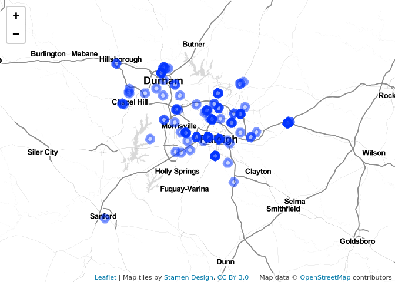
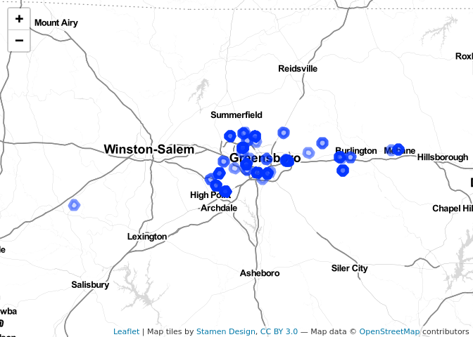

HW4: Scraping Craigslist, PLAN 672
================
Alfredo Rojas
2/17/2020

### Scraping Craigslist data

This assignment will show different “Walk Scores” for Craigslist
listings in the North Carolina Triad: Raleigh-Durham, Greensboro, and
Winston-Salem. For this projecct, a Walk Score is defined as the amount
of restaurants within 5,000 feet of selected listings. The number of
restaurants are then used to create a standarizes “score” for each
listing, where lower scores indicate little if any restaurants within
walking distance and higher scores indicating some or many restaurants.
This is a useful metric to know since it will help Craigslist users
understand what kind of amenities exist in their area. Walk Scores
generally include a more complicated metric, incorporating information
about sidewalks, roads, and numerous amenities. For this assignment, I
am only using number of restaurants as a proxy to practice creating
these kinds of scores. Additonally, only the firt 120 listings of
Craigslist for each city will be used.

### Method

The overall structure of this code is a `for` loop, using the names of
cities as indices to produce the needed URLs and query strings. The data
extraction methods inside the `for` loop are largely from Prof. Kaza’s
[tutorial](https://sia.planning.unc.edu/post/2020-02-04-scraping-craigslist-posts/).
Where appropriate, I make some modifications for this assignment. Within
the `for` loop, different web scraping methods are performed to extract
latitude/longitude data. Then, I find some restaurant locations through
OpenStreetMaps, and then perform spatial operations to create the Walk
Scores. An example of a URL and query would be:
“<https://winstonsalem.craigslist.org/search/apa?min_bathrooms=2&availabilityMode=0&sale_date=all+dates>”
where query strings beginning after the “?”.

After this data processing step, I provide some basic visualizations to
see how these locations differ from one another in terms of their Walk
Scores.

To get the count of amenities within walking distance, I created a
5,000ft buffer around each Craigslist listing and counted the number of
restaurants that fell within each buffer. Here is a visualization, where
the large circle represents a buffer and the smaller circles are
individual restaurant locations.

``` r
plot(st_geometry(df_winstonsalem[3,1]))
plot(st_geometry(rstnt_osm), add = TRUE) # seems to work. . .  
```

<!-- -->

Plotting Walk Scores in an interactive map, for Raleigh-Durham, we can
see the spatial distribution of buffers as well as their walk score if
you click on the circle. One pattern you might see is the farther away
we are from central cities, like Raleigh, the lower the walk score.
Observe the low score near Clayton (~ -0.4) versus the other scores in
the middle of Raleigh.

``` r
# help from: https://cengel.github.io/R-spatial/mapping.html
popup_info <- paste0("<strong>Walk Score [-1 (low) to 5 (high)]: </strong>", 
                     round(df_raleigh$pt_scale, 3))

leaflet(st_transform(df_raleigh, crs = 4326)) %>% 
  addProviderTiles(providers$Stamen.TonerLines, group = "Basemap") %>%
  addProviderTiles(providers$Stamen.TonerLite, group = "Basemap") %>%
  addPolygons(popup = popup_info)
```

<!-- -->

Let’s take a look at Greensboro and
Winston-Salem.

``` r
popup_info2 <- paste0("<strong>Walk Score [-1 (low) to 5 (high)]: </strong>", 
                      round(df_greensboro$pt_scale, 3))

leaflet(st_transform(df_greensboro, crs = 4326)) %>% 
  addProviderTiles(providers$Stamen.TonerLines, group = "Basemap") %>%
  addProviderTiles(providers$Stamen.TonerLite, group = "Basemap") %>%
  addPolygons(popup = popup_info2)
```

<!-- -->

``` r
popup_info3 <- paste0("<strong>Walk Score [-1 (low) to 5 (high)]: </strong>", 
                      round(df_winstonsalem$pt_scale, 3))

leaflet(st_transform(df_winstonsalem, crs = 4326)) %>% 
  addProviderTiles(providers$Stamen.TonerLines, group = "Basemap") %>%
  addProviderTiles(providers$Stamen.TonerLite, group = "Basemap") %>%
  addPolygons(popup = popup_info3)
```

<!-- -->

We see a similar pattern of decreasing Walk Scores as we move farther
away from city centers. There also seems to be some outliers, near
Charlotte and Jacksonville, NC. Perhaps this is an error in the original
Craigslist listing. But, we still get buffers clustered around cities of
interest in the NC Triad area.

## Analysis and Conclusion

Even though my Walk Score, conditioned by restaurants only, could have
incorporated many more variables, like sidewalks, highways, cafe’s,
parks, etc., we can still see a general pattern of higher Walk Scores in
city centers as opposed to lower scores the farther away from the city.
This makes sense. A Craigslist listing in or near downtown
Winston-Salem, for example, is bound to be next to restaurants within a
walking distance. Other listings that are farther away may not be near
any restaurants. This could also be due to the fact that many areas of
North Carolina are closer to rural locations, meaning the density of
such restaurants may not be as high as in suburbs, like around Durham.
In the future, I can include more relevant variables into my walk score
to get a more detailed portrait of a city’s “walkability”. For now,
using restaurants as our proxy gives us some insight into this for the
NC Triad area.
